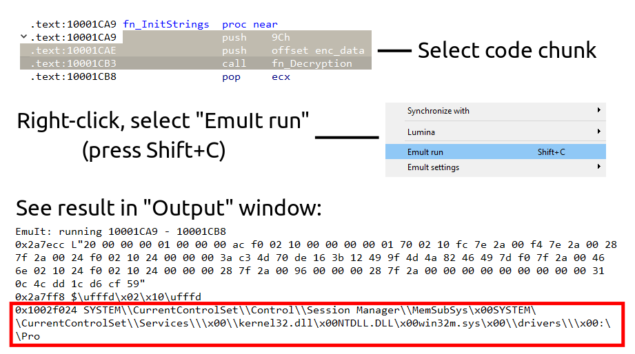

## EmuIt - easy-to-use IDA emulator plugin

### Use cases
- Run code without starting debug session (broken dump, driver, firmware...)
- Find decryption function in malware and get all decrypted strings 
- Automate process of config extraction

### Quick example


### Installation
if you have installed `git`:
```shell
pip install https+git://github.com/AzzOnFire/emuit
```
or download/clone repository, `cd` inside and run
```shell
pip install .
```

For plugin support move `emuit/ida/emuit.py` to `%IDA_HOME%/plugins` directory

### Examples
```python
from emuit import EmuItX86_64
emu = EmuItX86_64(bitness=64)
```

Memory and registers manipulations:
```python
buffer = emu[0x400000:0x401000]  # read memory region
emu[0x1002F0C8] = "string"       # write string at address

ip = emu['EIP']         # get EIP value
emu['RDX'] = 0xABCDEF   # access by register name
emu['*DX'] = 0xABCDEF   # asterisk mean 'R' for x64 or 'E' for x86

emu.push(0xABCDEF)      # push value to stack
value = emu.pop()
```

Emulate arbitrary code chunk:
```python
result = emu.run(0x100000, 0x100020)
print(result)   # has helper methods `pretty`, `range`, `printable`
>>> {0x3000: 'decrypted string...', 0x24000: 'stack junk...', ...}
```

Call function:
> buffer for ASCII string 'some_str_buffer' will be allocated automatic, buffer ptr will be provided as an argument.
```python
start_ea, end_ea = 0x10021050, 0x10023010 
emu.stdcall(start_ea, end_ea, 'some_str_buffer', 0x6)
emu.fastcall(start_ea, end_ea, rcx='some_str_buffer', rdx=0x6)
```

### IDA Pro specific features
```python
from emuit import EmuItIda
emu = EmuItIda(skip_api_calls=True) # Try skip calls to API
```

Use IDA names
```python
emu['dword_1002F0C8'] = "string"           # access by location name
emu.stdcall('fn_Decrypt', 'enc_str', 0x6)  # call by name
```

Emulate all function `call`'s with automatic substitution of arguments (from `idaapi.get_arg_addrs`)

> **Important:** function must have finalized prototype (black 'T' flag in IDA functions view or function name black highlight) 
```python
for xref in idautils.XrefsTo(0x10021050):
    call_ea = xref.frm
    emu.luckycall(call_ea)
```

For skipping unnecessary API calls enable that feature in context (right click) menu. For example, following `call` will be skipped with stack restoring.
```C
// SetErrorMode(0x8001u);
push    8001h
call    SetErrorMode
```

### Limitations
- Emulate code with API calls, syscalls
- Access to internal structures (PEB, SEH, ...)

### TODO
- (?) partial PEB emulation to deal with malware API resolve by hash
- ARM support
- More calling conventions
- More tests (ELF/Mach-O binaries)
- Instruction tracing with detailed error report
