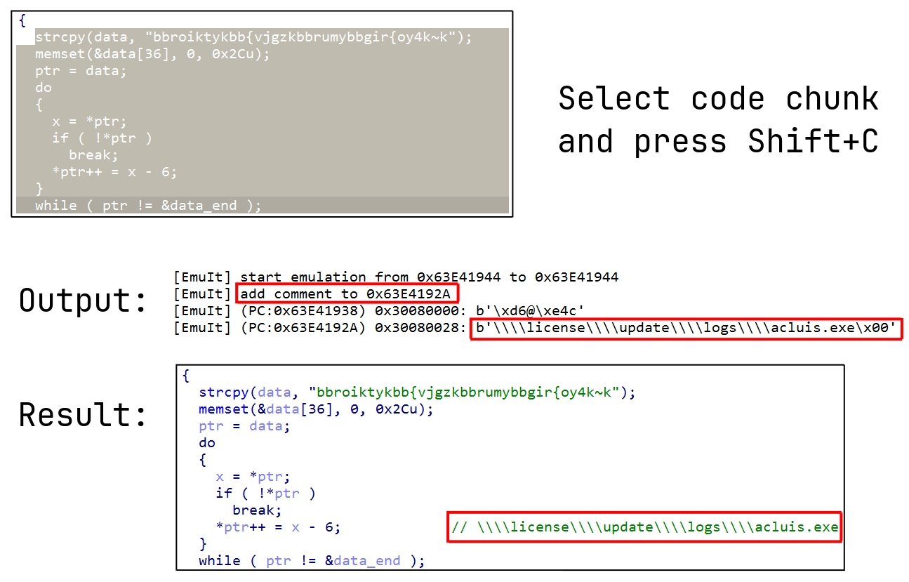

## EmuIt - easy-to-use IDA emulator plugin

### Features
- Emulate selected chunk of code and see decrypted/assembled strings
- Automatic memory allocation in case of incorrect write operations, stack unwinding and other techniques to improve emulation stability 
- Find decryption function in malware and get all decrypted strings
- Emulation of all calls to the specified function
- Automatic addition of a comment at the place where the string is decrypted (disassembly, pseudocode)
- Support all architectures supported by [unicorn emulator](https://github.com/unicorn-engine/unicorn)

### Quick example


### Installation

Copy `emuit.py` and `emuit` directory to your IDA plugins directory (depends on your system):
- **Windows**: `%APPDATA%\Hex-Rays\IDA Pro\plugins\`
- **macOS**: `~/Library/Application Support/IDA Pro/plugins/`
- **Linux**: `~/.idapro/plugins/`

Install `unicorn` with `pip install unicorn`. 

### Usage in scripts
```python
from emuit import EmuIt
emu = EmuIt.create(architecture='x86', bitness=64)
```

Memory and registers operations just like in [Qiling](https://github.com/qilingframework/qiling):
```python
buffer = emu.mem[0x400000:0x401000]  # read memory region
emu.mem[0x1002F0C8] = b"string"     # write string at address

ip = emu.arch.regs.arch_pc           # get RIP value
emu.arch.regs['RDX'] = 0xABCDEF      # access by register name
emu.arch.regs['*DX'] = 0xABCDEF      # asterisk mean 'R' for x64 or 'E' for x86

emu.arch.stack_push(0xABCDEF)        # push value to stack
value = emu.arch.stack_pop()         # pop value from stack
```

Emulate arbitrary code chunk:
```python
results = emu.run(0x100000, 0x100020)
>>> [Buffer(pc=0x20030, ea=0x100016, data=b'plain')]
```

Call function:
```python
start_ea, end_ea = 0x10021050, 0x10023010 
emu.arch.fastcall(
    start_ea,
    end_ea, 
    emu.mem.map_buffer(b'string!'),
    0x6,
)
```

### Limitations
- It is not possible to emulate code with API calls, syscalls, etc. The following projects are suitable for this: [Qiling](https://github.com/qilingframework/qiling), [Speakeasy](https://github.com/mandiant/speakeasy), [MWEmu](https://github.com/sha0coder/mwemu).
- Access to internal structures (PEB, SEH, ...) partially available in debug session

